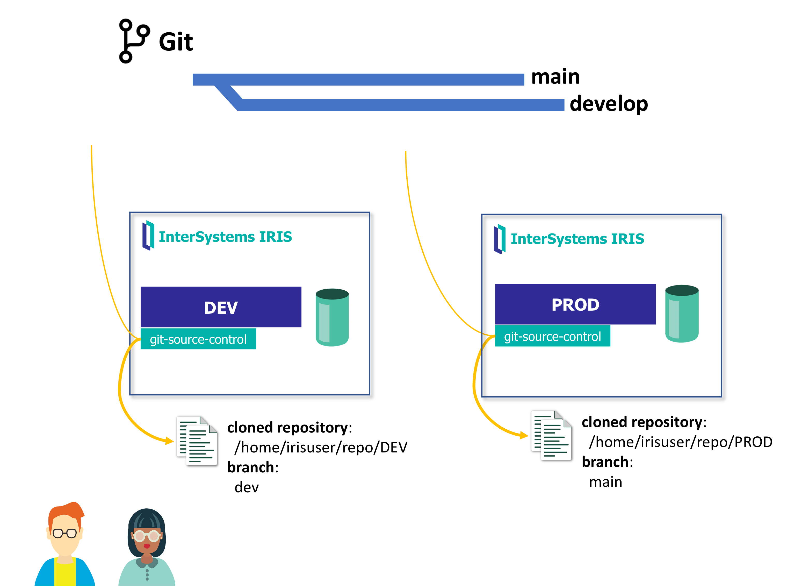
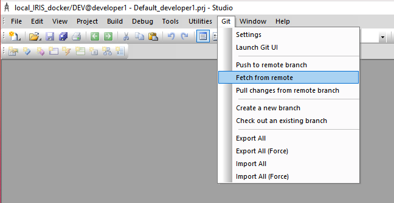

InterSystems IRIS shared envinroment using git source control.
We will be using [git-source-control](https://openexchange.intersystems.com/package/Git-for-Shared-Development-Environments). You can find more information on [Git for Shared Development Environments](https://community.intersystems.com/post/git-shared-development-environments).

# Setup
Run the container we will use as our IRIS shared instance:
```
docker-compose up -d
```

In the instance, you will find:
* Namespaces: `DEV` (development), `PROD` (production). 
* Users: `developer1/test`

# Configure git-source-control



## (a). Create ssh key
[git-source-control](https://openexchange.intersystems.com/package/Git-for-Shared-Development-Environments) will use ssh key to communicate from the IRIS shared instance to your remote git repository.

`irisuser` is the user that is executing IRIS processes in our shared instance.

* Open session in container as `irisuser`:
```
docker exec -u irisuser -it iris-shared bash
```

* Create ssh key:
```
ssh-keygen -t ed25519 -C "your_email@example.com"
```

* Add private key to `irisuser` ssh config:
```
vi ~/.ssh/config
``` 

Contents of ~/.ssh/config:
```
Host github.com
 HostName github.com
 IdentityFile /home/irisuser/.ssh/id_ed25519
```

## (b). Create/Clone a git repository for your code

Create a git repository ([GitHub](https://github.com)) for the code in the shared instance (e.g. `iris-shared-repo`). We will use different branches to represent each environment.

* Add the public part of your ssh key (e.g. `/home/irisuser/.ssh/id_ed25519.pub`) in GitHub using https://github.com/settings/keys. This will allow to use the ssh key to work with your repository.

* As `irisuser`, create a directory for each environment. We will clone the repo for each environment, as each one of them will be working in a different branch.
```
mkdir -p /home/irisuser/repo
```

* As `irisuser`, clone your repository in every directory. You will be using your configured ssh key:

```
git config --global user.email "your@email.com"
git config --global user.name "yourname"
```

### (b.1) Clone you repository for DEV environment
* Clone your repository
* Create a first commit on the main branch to initilize the repo.
* Create a "dev" branch and push it to GitHub.

```
cd /home/irisuser/repo
git clone git@github.com:yourgithubuser/iris-shared-repo.git DEV
cd DEV
echo "# README" >> README.md
git add README.md
git commit -m "first commit"
git push
git checkout -b "dev"
git push --set-upstream origin dev
```

### (b.2) Clone you repository for PROD environment
* Clone your repository
* We will be using main branch for our production environment.

```
cd /home/irisuser/repo
git clone git@github.com:yourgithubuser/iris-shared-repo.git PROD
```

# (c) Configure source control in IRIS 

## (c.1) Configure DEV namespace for source control
* Open a terminal session as `developer1` and run git source control configuration:
```
irisuser@51e2506c043c:~$ iris session iris
USER>zn "DEV"
DEV>do ##class(SourceControl.Git.API).Configure()
Configured SourceControl.Git.Extension as source control class for namespace DEV
Configured default mappings for classes, routines, and include files. You can customize these in the global:
     ^SYS("SourceControl","Git","settings","mappings")
Path to git executable: /usr/bin/git
Local git repo root folder: c:\temp\USER/ => /home/irisuser/repo/DEV
Path to private key file (for ssh remotes): /home/irisuser/.ssh/id_ed25519
Event handler class for git pull: 
  SourceControl.Git.PullEventHandler.Default => 
Attribution: Git username for user 'irisowner': your-github-user
Attribution: Email address for user 'irisowner': your-github-email
Settings saved.
```

## (c.2) Configure PROD namespace for source control
* Open a terminal session as `developer1` and run git source control configuration:
```
irisuser@51e2506c043c:~$ iris session iris
USER>zn "PROD"
PROD>do ##class(SourceControl.Git.API).Configure()
Configured SourceControl.Git.Extension as source control class for namespace PROD
Configured default mappings for classes, routines, and include files. You can customize these in the global:
     ^SYS("SourceControl","Git","settings","mappings")
Path to git executable: /usr/bin/git
Local git repo root folder: c:\temp\USER/ => /home/irisuser/repo/PROD
Path to private key file (for ssh remotes): /home/irisuser/.ssh/id_ed25519
Event handler class for git pull: 
  SourceControl.Git.PullEventHandler.Default => 
Attribution: Git username for user 'irisowner': your-github-user
Attribution: Email address for user 'irisowner': your-github-email
Settings saved.
```

# (d) Connect using Studio
* Connect to IRIS instance using Studio as usual
* Notice that when entering `DEV` or `PROD` namespace, you have a new available Git menu on the toolbar.




# (e) Connect using VS Code
* Setup IRIS instance configuration using VS Code as usual using InterSystems Server Manager plugin. Save your connection using some name like `workshop-git~iris`.
* Create a VS Code workspace file like this:
```
{
	"folders": [
		{
			"name": "isfs_DEV",
			"uri": "isfs://workshop-git~iris:DEV/"
		},
		{
			"name": "isfs_PROD",
			"uri": "isfs://workshop-git~iris:PROD/"
		}
	],
	"settings": {}
}
```
* In VS Code, open the workspace file you have just created using File > Open Workspace file.
* In your workspace, you will have available Git menu options as well.


# (f) Make changes and deploy them

## (f.1) Make some changes in DEV
Using Git command menus and Git UI try to:
* Connect to `DEV` namespace
* Create some classes (e.g. `MyApp/Test`, `MyApp/Info`).
* Add classes
* Create a Production, a Data Transform or a Business Process. Notice that you have available Git actions from the Management Portal as well
* Commit changes
* Push changes to GitHub (dev branch)

## (f.2) Deploy changes from DEV to PROD
* In GitHub, create a Pull request from dev branch to main branch
* Merge pull request
* In Studio/VS Code, move to PROD namespace, and Pull changes from remote branch and Import All.
* Check that changes are now deployed in PROD environment.
