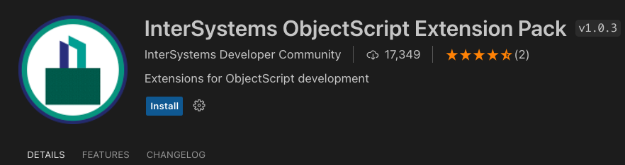

InterSystems IRIS shared environment using git source control with server-side editing in VS Code.

We will be using [git-source-control](https://openexchange.intersystems.com/package/Git-for-Shared-Development-Environments). You can find more information on [Git for Shared Development Environments](https://community.intersystems.com/post/git-shared-development-environments).


# Setup
Run the container we will use as our IRIS shared instance:
```
docker-compose up -d
```

In the instance, you will find:
* Namespaces: `DEV` (development), `PROD` (production). 
* User: `developer1` / `test`


# Server-side editing in VS Code

Setup IRIS server-side editing in VS Code.

The code in your shared environment will be edited this way.

* Open VS Code
* Install InterSystems ObjectScript Extension Pack




* Click on InterSystems icon
* Add a Server configuration
workshop-git-shared-iris


* Open Server
* Edit Dev namespace
* Edit Prod namespace


* Save as VS Code workspace. Save it to a file called "test.code-workspace"


The contents of the file will be something like this:

```json
{
	"folders": [
		{
			"name": "workshop-iris-shared-git:DEV",
			"uri": "isfs://workshop-iris-shared-git:dev/"
		},
		{
			"name": "workshop-iris-shared-git:PROD",
			"uri": "isfs://workshop-iris-shared-git:prod/"
		}
	]
}
```

Now you can access the code of both IRIS namespaces from your VS Code workspace.

# Create a GitHub repo

Create a new repository in your GitHub account. You will use this repository to store the code for DEV and PROD.

You can name it something like `iris-shared-repo`.


# Set up Git Source Control in IRIS

You will set up [Git for Shared Environments](https://openexchange.intersystems.com/package/Git-for-Shared-Development-Environments) package in InterSystems IRIS.

It is already installed, but you could install it simply running: 

```objectscript
zpm "install git-source-control" 
```

Open a InterSystems terminal in VS Code so you can run the next sections:


## Setup Git in DEV namespace

Run [Git for Shared Environments](https://openexchange.intersystems.com/package/Git-for-Shared-Development-Environments) setup:

```objectscript
do ##class(SourceControl.Git.API).Configure()
```

* Path to git executable: `/usr/bin/git`
* Local git repo root folder: `/home/irisowner/repo/DEV/`
* Path to private key file for SSH remotes; if file does not exist, later prompts will help set it up with proper ownership: `/home/irisowner/.ssh/id_ed25519`
* Default value for the remaining settings

### Create an SSH key pair
You will be asked if you want to create an SSH key pair. This key will be needed to connect to your GitHub repository securely using SSH.

* Create an SSH key pair? `Yes`
* Copy the **Public Key** for your generated SSH key pair

```console
Public key (for use as "deploy key", etc.):
ssh-ed25519 <somekey> developer1@bf3016a8ae64
```

* Add the **Public key** to your GitHub https://github.com/settings/keys so you authorize connections using that key.

### Clone repository

Last step of setup let us you choose what do you want to do with the directory we have just specified:

```console
1) Initialize empty repo
2) Clone...
3) Do nothing

No git repo exists in /home/irisowner/repo/DEV/. Choose an option:
```

Choose **2) Clone** and enter the **SSH** URL of your GitHub repository. This should be something like:

```console
git@github.com:<your-github-user-name>/iris-shared-repo.git
```

## Setup Git in PROD namespace

Run a similar setup but for PROD namespace:

```objectscript
zn "PROD"
do ##class(SourceControl.Git.API).Configure()
```

* Path to git executable: `/usr/bin/git`
* Local git repo root folder: `/home/irisowner/repo/PROD/`
* Path to private key file for SSH remotes; if file does not exist, later prompts will help set it up with proper ownership: `/home/irisowner/.ssh/id_ed25519`
* Default value for the remaining settings


# Work with VS Code, IRIS and Git

## Make some changes in DEV namespace

* When you connect to DEV namespace, new Git options will appear in VS Code command line.
* You can also open Git UI.
* We are going to create a local `dev` branch and add a new class:


* After pushing `dev` branch to GitHub remote, create a Pull Request so changes will be merged into `main` branch.


# Deploy changes in main into PROD namespace

Now you can connect to your PROD namespace and pull changes from `main` branch:

<imgr src="img/vscode-deploy-changes-main.gif" width="600" />
